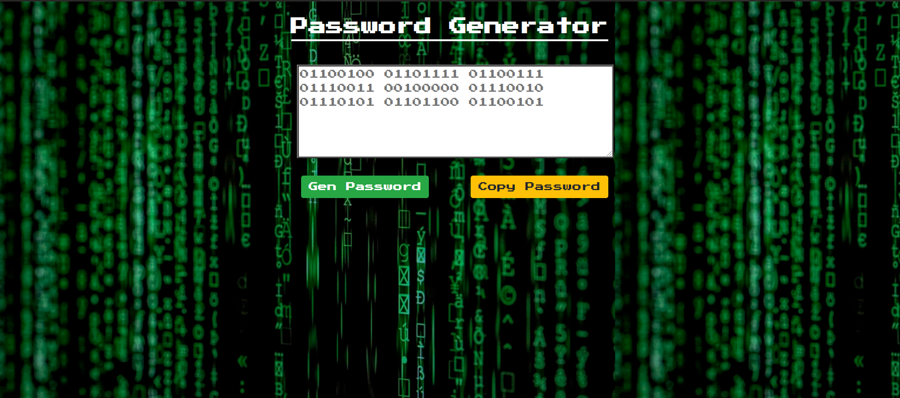

# Password-Generator

## Description
This is an application that generates a random password based on user-selected criteria. This app will run in the browser and feature dynamically updated HTML and CSS powered by JavaScript code. 

## Table of Contents
* [Installation](#installation)
* [Screenshot](#screenshot)
* [Technologies-Libraries](#technologies-libraries)
* [Credits](#credits)

## Installation
In your terminal type:
```git clone https://github.com/verlitas/Password-Generator.git```
* Open in Visual Studio to build and run.
* For further instructions, visit https://help.github.com.

## Technologies-Libraries
CSS - HTML - Bootstrap - JavaScript

## Screenshot


## Credits
[UABootCamp](https://bootcamp.ce.arizona.edu/coding/)

